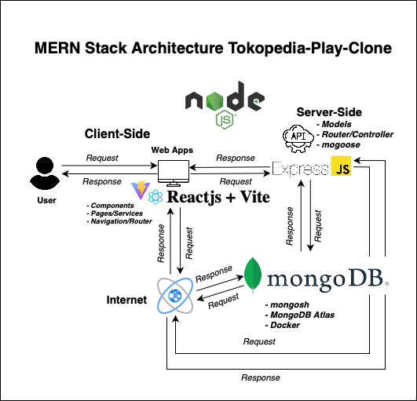

# Final Project Generasi Gigih (FrontEnd)

This repository was created as proof that the Final Project Generation Gigih 3.0 Full Stack Engineering by GoTo Impact Foundation has been completed

## Back-End Final Project

If you want to see Front-End Final Project Generasi Gigih you can access :
`https://github.com/zidaneibrahimf7/backend-finalproject-gigih`

# Project Development Schema



## Tech Stack (Dependecies)

`MERN Stack`

- Code Editor : VS Code
- Front End :
  - React.js
  - Vite
  - React-Router
  - React-Query
  - Tailwind CSS
- Back End :
  - Express.js
  - Server Side Event
  - cors
  - body-parser
  - mongoose
  - nodemon
  - dotenv
    Detail backend database and API Architecture you can access in Back-End Final Project :)

## Features

1. Multi-Page Navigation

   - `Home Page`
   - `Video Detail Pages`

2. Home Page :

   - Users can view various videos that are displayed based on database.
   - users can view search box to get some product based on database.

3. Video Detail Pages :

   - Users get information in the form of product names, product images, and related product videos taken from YouTube along with price information.
   - users can view comments and be able to write comments by writing the name or username and comments given on a product. In addition, users can delete comments that have been submitted on the page

4. Comments :

   - Users can make comments
   - In using the comments feature, the user needs to enter a name/username and comment then click submit
   - Users can delete comments by clicking "Delete"

### List Bonus Feature

- Real-Time Commenting with SSE (Server Side Event) :
  - `User can write a comments and submit it. The system automatically added a comment from user`
  - `User can delete comments by clicking "delete"`

## Folder Structure

- `public` : Public Asset
- `src` : root folder for rendering some source code
  - `Components` : root folder for rendering contents in webapps
  - `Pages` : root folder for rendering pages routing each pages
- `App.jsx` : main App
- `index.css` : main style (using tailwind.css as UI Library)
- `tailwind.config.js` : tailwindcss depedencies to generate style in web
- `vite.config.js` : vite+react depedencies for library framework generated

For Backend Folder Structure you can access the Back-End Final Project Here
`https://github.com/zidaneibrahimf7/backend-finalproject-gigih`

## How to Run! (Getting Started Run Locally)

1. Clone the project or this repository

```bash
git clone https://github.com/zidaneibrahimf7/backend-finalproject-gigih.git
```

2. install dependencies

```bash
npm install
```

3. Run the project

```bash
npm start
```

Open your web browser and visit `http://(yourlocalhost)` to access the application

### API Request and Response

| Method | Endpoint                              | Description                          | Access |
| ------ | ------------------------------------- | ------------------------------------ | ------ |
| GET    | `api/video/`                          | get all video list video Thumbnail   | user   |
| GET    | `api/product/:videoID`                | get product properties from videoID  | user   |
| GET    | `api/product/search`                  | get product details search bar       | user   |
| GET    | `api/comment/:videoID`                | get all comment list from database   | user   |
| POST   | `api/comment/submit-comment`          | post comment list to database        | user   |
| DELETE | `api/comment/delete-comment/:videoID` | delete comment user list in database | user   |

API list example you can see at [!API Example Request and Response](https://gist.github.com/zidaneibrahimf7/440cda5e17d8e41e67258d2f0bb676c4)

## Additional

- Search Box
  I have tried adding the search bar feature. The bad news is it still can't bring up the product when using the search bar, I'm sorry. But the good news, the search box feature appears in the application. More details for the search box feature are in the `SearchBox.js`component. I have also added this search feature by integrating it with the API. the API endpoint inside the back-end is `/api/product/search/:videoID`
- Server Side Event
  Actually, I want to try using Websocket, but I find it very difficult. However, I tried using SSE. I don't know for sure if it's SSE, but by using that code, I don't need to refresh the page when a user submits a comment or deletes a comment. More details about the SSE concept that I have built can be seen in `VideoDetail.jsx` from `line 78 (submit comments) to line 128 (delete comments)`
